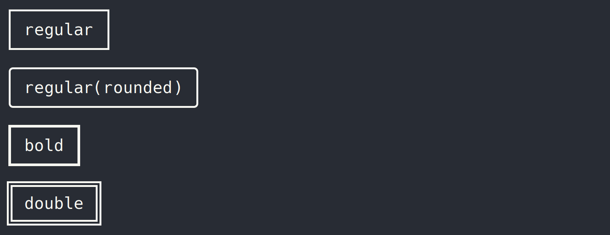

# BoxDraw.py

A python3 script that draws a box around a string of text using unicode box-drawing characters.



## Installation
> Only tested on linux.

Download the script.

```bash
git clone https://github.com/nat3boi/BoxDraw.py.git
```
Change directory into repository's folder and make the script executable.

```bash
cd BoxDraw.py && sudo chmod +x boxdraw.py
```

> **Tip:** You can change the name and move it to a directory in you shell's path to use it as a regular program (without `./` and from any directory). 

## Usage
> Note: Github will not render these correctly and they will not be connected. If you are using a proper fixed-width/monospace font in your terminal they should look correct, like the screenshot above.

Execute the script and type a string of text into the command line.

Without any option selected, you will get the default ouput (regular). 

```bash
./boxdraw.py 
```
```
my text
```

**Output:**
```STDOUT
┌─────────┐
│ my text │
└─────────┘
```

### With options and arguments
As of now, the only option available is `-t` `--type`.

Available arguments are `r` (Regular), `rr` (Regular-Rounded), `b` (Bold), `d`(double).

#### Example:

```bash
./boxdraw.py -t d
```
```
your text here
```

**Output:**
```
╔════════════════╗
║ your text here ║
╚════════════════╝
```

You can also redirect this ouput to a file.
```bash 
./boxdraw.py -t rr >> file.txt
```
```
your text here
```
```bash
cat file.txt
╭────────────────╮
│ your text here │
╰────────────────╯
```
> [!WARNING]
>In the above Command, make sure you use **2** angle brakets `>>`. If you acidentally just use 1, you will overwrite your file instead of appending the text to it.

## Why

I wanted to make my configuration files look cleaner so I decided to draw boxes around all of the titles for the different sections.

I found myself copying characters from char-map, saving them into a file, and using vim to edit them and get my text in the box. 

That's too much work so I decided to write a script to automate it.

I'm sure there are other, easier ways of doing this but i'm also just doing this for fun.

If you have any suggestions on how to make this script better and more robust, feel free to collaborate. 

## Future plans
- Add ability to have string of text as argument instead of only using STDIN
    - `boxdraw -t d "your text here"`
- Add more characters to choose from and maybe combine them for a beveled look.
